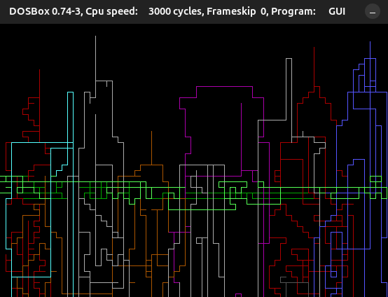

----------------------------
2D GRAPHICS ENGINE
----------------------------

A freestanding 16-bit real-mode 2D graphics engine that builds to a DOS `.COM`
executable (`gui.com`). It mixes 16-bit C (GCC `.code16gcc`) with NASM assembly
and talks to hardware directly through BIOS interrupts — no standard library,
no OS services, no `malloc`. Run it ships as a small interactive paint program:
steer a cursor with the keyboard, cycle colors, and stamp rectangles.



----------------------------
FEATURES
----------------------------

[+] Pure freestanding 16-bit code — boots straight into VGA mode `0x12` (640x480, 16 colors).

[+] Clean C-over-assembly layering: all BIOS interrupts isolated in one `.asm` file.

[+] Custom bump allocator with `save`/`load` checkpoints (no `malloc`, no heap fragmentation).

[+] Bit-packed shape primitives: points, lines, and rectangles.

[+] Interactive WASD paint demo with color cycling and anchor-based rectangles.

----------------------------
REQUIREMENTS
----------------------------

[+] `gcc` with 16-bit support (`-m16`).

[+] `nasm` (assembler).

[+] `ld` (GNU linker).

[+] A real-mode environment to run the result, e.g. DOSBox or QEMU.


On Debian/Ubuntu:

```bash
sudo apt install gcc nasm binutils dosbox
```

----------------------------
BUILD
----------------------------

```bash
make          # builds gui.com
make clean    # removes *.o and *.com
```

----------------------------
RUN
----------------------------

`gui.com` is a DOS program and cannot run natively on Linux. Launch it in
DOSBox:

```bash
dosbox gui.com
```

Or from the DOSBox prompt:

```bash
mount c .
c:
gui.com
```

----------------------------
CONTROLS
----------------------------

[+] `w` / `a` / `s` / `d` — move the cursor (draws a trail in the current color).

[+] `c` — cycle the draw color (1-15).

[+] `space` — drop a rectangle anchor at the cursor.

[+] `r` — draw a rectangle from the anchor to the cursor.

[+] `q` — quit.

----------------------------
PROJECT LAYOUT
----------------------------

[+] [main.c](main.c) — entry point, interactive paint loop, heap allocator, and basic I/O.

[+] [shapes.c](shapes.c) — shape constructors (`mk*`) and renderers (`draw*`).

[+] [xgfx.asm](xgfx.asm) — the only layer that issues BIOS interrupts; reserves the heap.

[+] [include/](include/gui.h) — core types, macros, packed shape structs, and prototypes.

[+] [gui.ld](gui.ld) — linker script producing the flat `.COM` binary at origin `0x100`.

[+] [Makefile](Makefile) — build rules and toolchain flags.

For architecture details and contribution conventions, see [AGENTS.md](AGENTS.md).

----------------------------
HOW IT WORKS
----------------------------

C logic in [main.c](main.c) and [shapes.c](shapes.c) never touches hardware
directly — it calls the `x*` routines in [xgfx.asm](xgfx.asm), which own every
BIOS `int` call. Shapes compose from the bottom up: a line is a loop of points,
a rectangle is four lines. Memory comes from a bump allocator; scratch
allocations inside draw loops are reclaimed with `save()` / `load()` instead of
being freed.

----x----x----x----x----x----
